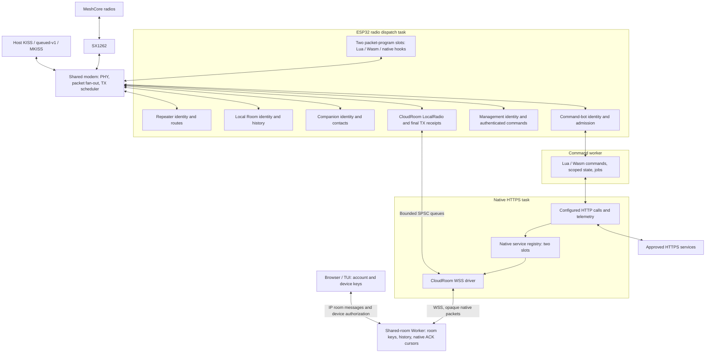
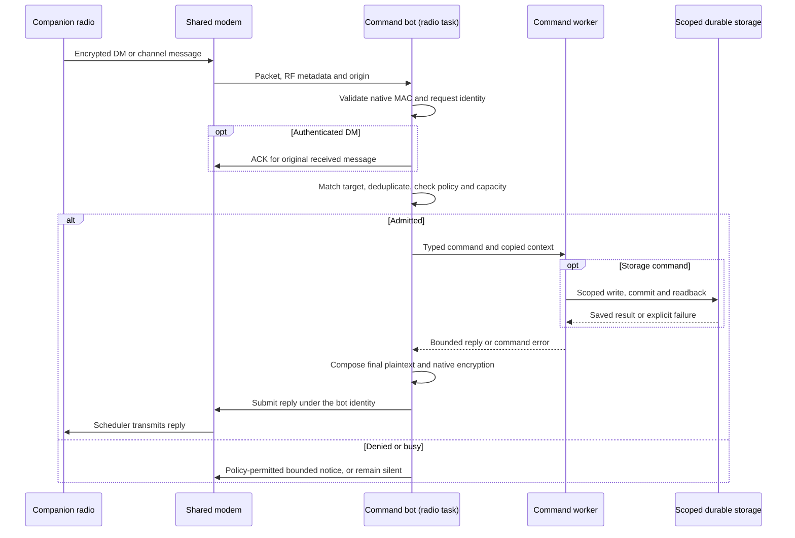
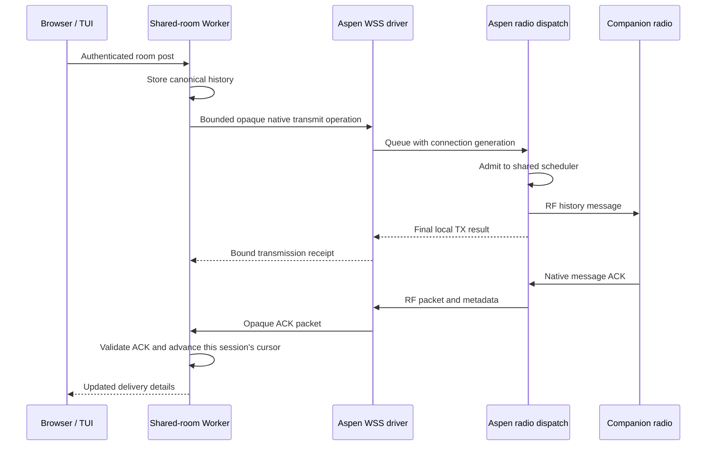
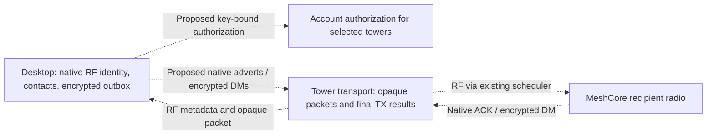

# Aspen services and packet flow

Aspen runs separate MeshCore identities on one ESP32-S3 and one SX1262.
Configure the roles and services you need in the generic image; they share
the modem's physical profile, transmit queue and airtime budget. Start with
[USB setup](firmware/esp32/PUBLIC_SETUP.md), then use the
[command guide](COMMANDS.md) to inspect and configure the running node.

This page describes the implemented source architecture. The
[proposed desktop DM path](#proposed-desktop-rf-and-dms) is shown separately.
Board wiring, byte formats and execution limits live in the linked references.

## Running services



The local Room and Worker-backed room aliases are different services. The
local Room owns its identity and history on the radio. The Worker owns its
room keys and canonical history; Aspen's frontend carries opaque packets and
does not hold those private keys. Browser/TUI device keys identify IP message
authors. The companion role owns the Base identity used by applications
connected to its TCP endpoint.

Management owns mast-wide configuration. A Repeater or Room administrator
controls that role's local preferences and ACL, not the shared PHY or other
roles. The command bot's saved aliases are addressing names, not identities
or administrator grants.

The generic image reserves two room sockets, one HTTPS connection, one KISS
connection, two companion clients and two live dashboard viewers within the
SDK socket budget. MKISS can carry several logical host ports over the one
KISS connection. Disabled services keep the image's capacity reservation.
See [native frontend configuration](services/shared-room/NATIVE.md) and
[native service registration](firmware/runtime/NATIVE_SERVICES.md).

## A bot command and its reply



An inbound DM ACK acknowledges the message bytes, not command completion.
Channel messages have no authenticated individual sender and no DM ACK.
Targeting chooses which bot handles a request; the applicable command/action
and storage masks still decide what it may do and whether it replies.
An addressed-only channel stays silent for bare or mismatched requests.

The worker never reads live role or radio objects. Context and statistics are
copied at dispatch; radio and owner operations return through native queues.
Storage replies report the saved result. Replacing source cancels its pending
work, but cannot undo effects already admitted or committed. See
[command syntax and permissions](firmware/runtime/BOT_RUNTIME.md) and
[source installation and recovery](firmware/esp32/MAST_ADMIN.md#source-and-help-installation).

## Packet hooks and transaction boundaries

Programs run on the radio task at eight selectable stages. Raw receive runs
before fan-out; local delivery uses a separate copy for each on-device role.
Native relay runs after that role's routing edits. Native plaintext receive
runs after MAC/signature validation; plaintext compose runs before encryption
or signing under an owned identity. Admission, transmit and reflection cover
the shared modem's outgoing path.

```mermaid
sequenceDiagram
    participant R as Radio dispatch / native role
    participant P as Packet pipeline
    participant E as Enabled engine
    participant Q as TX scheduler / pending PHY controller
    R->>P: Invoke selected hook with packet and origin
    P->>P: Snapshot original and create staged effects
    P->>E: Bounded invocation
    E-->>P: Edits, emissions, optional PHY request, decision
    alt Valid Continue or Drop
        P->>Q: Publish permitted staged effects
        P-->>R: Edited packet, or drop this packet
    else Fault or exceeded budget
        P->>P: Restore original; discard this invocation's effects
        P->>E: Disable offender
        P-->>R: Continue with original packet and report fault
    end
    Q->>Q: Enforce source generation, capacity and airtime
```

A hook may stage up to two emissions. Generated packets retain their origin
and do not recursively invoke the originating engine. A valid drop can still
publish staged effects. A fault rolls back the whole invocation. Program
capabilities separately grant system reads, shared-PHY changes and native
owned-identity composition; private keys and channel secrets stay in native
code.

Receive ACKs use the original received plaintext. Outgoing message and room
post ACKs use the final composed plaintext. A later raw-ciphertext edit cannot
repair an encryption MAC or expected message ACK. A local reflection happens
after confirmed transmission and is distinct from an RF reception.
See [packet ABI, stages and failure behavior](firmware/runtime/PACKET_ENGINES.md).

## Save and activate programs or service settings

Packet-program upload, command-source installation and service configuration
use separate saved selections. Uploading a packet program does not replace a
bot program, change an identity or enable a network service.

```mermaid
sequenceDiagram
    participant A as Authenticated administrator
    participant C as Packet-program controller
    participant L as Loader task
    participant F as Filesystem and journal
    participant P as Radio pipeline
    A->>C: begin, numbered chunks, commit
    C->>L: Candidate source and expected SHA256
    P->>P: Continue using previous program
    L->>L: Verify and initialize within runtime limits
    L->>F: Write spare source generation and verify readback
    L-->>C: Candidate or failure
    alt Candidate valid
        C->>F: Commit saved selection and read it back
        C->>P: Publish candidate and saved budget
        C-->>A: Selected hash and slot status
    else Candidate failed
        C-->>A: Explicit load/storage error; prior program retained
    end
```

Packet source, enable state and execution budget survive restart. Runtime
globals and memory start fresh. A packet fault disables the offender and
saves that disabled state; a journal whose outcome is unknown seals the slot
until `retry` reconciles its selection. Install/rollback/reset of bot sources
uses the bot's own journal and does not restore scoped data.

CloudRoom and MQTT settings save separately from their running connections.
A restart applies them. Home HTTPS and telemetry endpoint commits have their
own active/staged readbacks. Encrypted node backups include committed
configuration and valuable node state; application-only updates retain NVS
and the filesystem. Keep credentials, node backups and private setup images
outside public source and release assets.

## Room delivery through Aspen



Final TX results and radio ACKs are separate. A browser view never advances a
radio cursor. Cursor/session state remains in Worker SQLite when a radio
disappears; joining again can resume history. Disconnect invalidates unsent
frontend operations by generation. A transmission whose outcome is uncertain
is not replayed automatically. See the
[native frontend](services/shared-room/NATIVE.md) and
[web delivery interface](services/shared-room/WEB.md).

## Proposed desktop RF and DMs

Desktop MeshCore identities and direct messages are **not implemented** in
the browser/TUI. Current clients use IP room messages; use a companion
application for DMs. The proposed path keeps the RF private identity on the
desktop and adds explicitly authorized home-tower transport:



The design uses existing native packets, distinct desktop/device identities,
explicit tower selection and a persisted outbox. The first valid recipient
ACK ends the delivery race; an uncertain transmission remains uncertain
across reconnect. Offline store-and-forward and any migration of existing
desktop keys still need decisions before implementation. The
[focused proposal](services/shared-room/DESKTOP_RF_DM.md) records those choices.
The native service registry's second slot is available for a future module,
but does not supply a tower API or DM service by itself.
