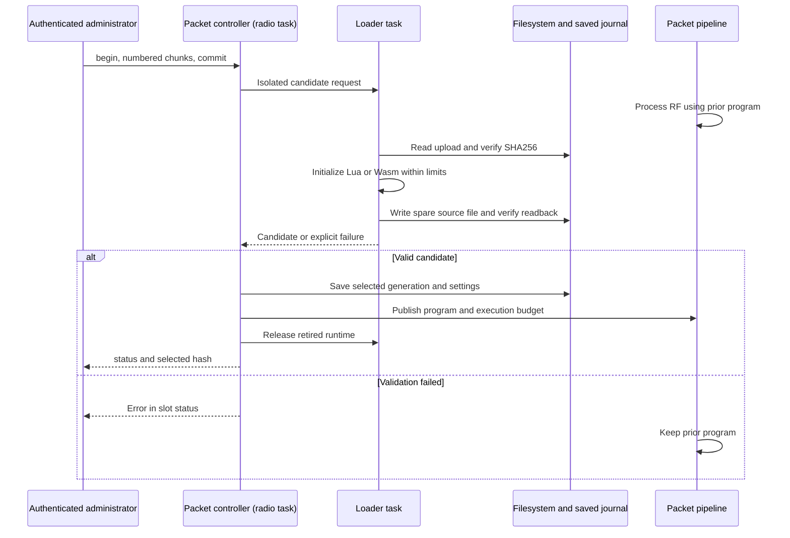

# Packet engines

Install a Lua or portable Wasm packet program on Aspen's shared modem, or
embed a C++ engine in a native application.
Engines can read, replace, modify or drop packets, and stage
up to two transmissions per hook invocation. Register them on the radio
dispatch task; they run on that task, not the command worker.
Nothing is enabled by default.

Current Aspen source builds expose two saved program slots through direct
authenticated Management RF or web administration. Run `packet api` to read
the image's available runtimes. Installation uses the existing command
transport; source and execution settings survive an application-only update
and restart. New slots start disabled until explicitly enabled.

Programs can also read node/PHY state, stage a shared-PHY change, or construct
an advert or encrypted datagram with an active on-device identity. Grant those
services explicitly when registering the engine. Private keys and configured
channel secrets stay in native code.

## Install and configure a program

Create `inspect.lua`:

```lua
return function()
  local info = packet.info()
  if info.stage == 0 and info.length > 0 then
    local first = packet.read(0, 1)
  end
  return packet.CONTINUE
end
```

This program reads received packet metadata and one byte, leaving the packet
unchanged. From the repository root, use the
[admin client prerequisites](../esp32/MAST_ADMIN.md#cli-prerequisites) and
your existing private Management password file:

```sh
python3 tools/hardware/admin.py --web http://RADIO \
  --password-file /private/node-password command 'packet api'
python3 tools/hardware/admin.py --web http://RADIO \
  --password-file /private/node-password packet install 0 inspect.lua
python3 tools/hardware/admin.py --web http://RADIO \
  --password-file /private/node-password packet budget 0 1 3000 800 0
python3 tools/hardware/admin.py --web http://RADIO \
  --password-file /private/node-password packet enable 0 on
```

Installation validates the source hash, initializes the runtime on a loader
task, checks a durable file copy, then publishes the saved selection on the
radio task. A new slot reports `saved program disabled`. Replacing an enabled
program preserves its enabled state and execution settings. RF processing
continues through the previous program during replacement; on initial boot it
continues unchanged until saved programs finish loading. Lua global state and
Wasm memory start fresh on each load; only source, settings and selections are
saved.

Use `packet SLOT status`, `hash`, `stats`, `memory` and `timing` to inspect a
slot. `stats` includes the live call, fault and drop counts and its saved
execution budget. `memory` reports runtime allocation categories in bytes;
`timing` reports measured loading/last-invocation microseconds and instruction
and native-call counts. VM measurements reset when the program loads.
Pipeline call/fault/drop counts reset when the controller restarts.
The loader allocates up to 16 KiB of temporary source in PSRAM and a 16 KiB
internal task stack on first use; that stack remains allocated while the
controller runs. Replacement temporarily keeps both the active and candidate
runtime in memory. VM memory fields describe that runtime, not total free heap;
use `stats memory` and `stats psram` for node-wide headroom. Wasm's pool is
shared with command programs; do not add its size once per slot.

The same Python connection options support encrypted RF. Bot scripts, room
administrators and ordinary modem clients cannot install or configure these
programs through the Management backend.

| Management command | Parameters and result |
| --- | --- |
| `packet api` | Packet ABI, slot count, source/chunk limits, available runtimes, stage and service masks |
| `packet phy` | Shared PHY controller state and accepted/applied request counts |
| `packet phy cancel` | Cancels the currently pending program-requested PHY change before it applies |
| `packet SLOT status\|hash\|stats\|memory\|timing` | Slot `0` or `1`; saved/live enable state, fault text, selected SHA256, budgets/counters or runtime measurements |
| `packet SLOT budget [STAGES FUEL US CAPS]` | Omit all four values to read. Decimal stage mask `1..255`, fuel `1..100000`, per-call microseconds `1..20000`, capabilities `0..7`; saved and applied immediately |
| `packet SLOT enable on\|off` | Saves and applies enable state; `on` requires a loaded program |
| `packet SLOT begin ID16 lua\|wasm SIZE SHA256` | Starts an upload of `1..16384` bytes; ID is 16 lowercase hex characters, SHA256 is 64 |
| `packet SLOT chunk ID16 INDEX HEX` | Zero-based 48-byte chunk index; lowercase hex encodes exactly 48 bytes except the final chunk; repeating identical bytes is safe |
| `packet SLOT commit ID16` | Starts bounded hash/runtime/file validation; poll `status` and `hash` for the selected result |
| `packet SLOT cancel ID16` | Cancels that staged upload before commit; active programs remain unchanged |
| `packet SLOT read INDEX` | Reads a selected source chunk as `INDEX HEX`; Python `packet export SLOT FILE` creates a new private file and verifies its hash |
| `packet SLOT rollback` | Loads the previous saved source and swaps selections; retains the current budget and enabled state |
| `packet SLOT remove` | Saves an empty, disabled selection; retains the previous source for rollback |
| `packet SLOT retry` | Reads the saved journal again and reloads its selected source; use after a reported storage/load failure |

Stage bits are receive `1`, local delivery `2`, admission `4`, transmit `8`,
reflection `16`, relay `32`, plaintext receive `64` and plaintext compose `128`.
Capability bits are system read `1`, PHY write `2` and owned composition `4`.
For example, `budget 65 3000 800 5` runs on raw receive and plaintext receive,
allows 3000 fuel units/800 microseconds per hook, and grants system read and
owned composition. **Granting PHY write lets a program retune the shared modem
for every host and on-device role.** All packet editing/drop/emission operations
remain available within the selected stages and scheduler limits.

A script fault rolls back that invocation's edits and staged effects,
disables the offender and saves its disabled state on the next controller
service pass. Inspect its status before explicitly enabling it again.
Disabling or replacing a program stops future calls. Previously committed
transmissions stay in the normal scheduler; a previously accepted PHY change
remains pending until it applies, expires or is cancelled with `packet phy cancel`.
A rejected replacement keeps the prior source, live program and settings.
A journal save/readback failure disables the slot and reports `sealed=1`;
`retry` reconciles the actual saved selection before reactivation. A malformed
journal can be explicitly cleared with `remove`. Uploaded staging bytes are
temporary and do not resume after reboot; previously committed source remains.
Do not repeat a timed-out commit blindly; inspect status and the selected hash.



The shared modem exposes these raw hooks:

| Stage | Packet and consequence |
| --- | --- |
| `Receive` | RF bytes before the split to on-device roles and the host modem; a replacement reaches both |
| `LocalDelivery` | A separate copy for each on-device role; `destination` identifies its source slot |
| `Admission` | A submitted host or on-device packet before it enters the TX queue |
| `Transmit` | A queued packet immediately before the shared modem estimates airtime and starts RF |
| `Reflection` | A local copy after confirmed RF completion; changing this copy does not change the packet already transmitted |

`local` distinguishes reflection from RF reception. `engineOrigin` identifies
generated packets and native replies derived from them. `reflectionOrigin`
also follows replies derived from a local reflection, even when the reply
itself is an outgoing packet with `local=false`. Native receive and relay
hooks use the packet's stored RSSI/SNR, including after a receive delay.
Raw ciphertext edits do not recompute encryption MACs, signatures or message
ACK hashes.

Aspen's on-device roles also expose these hooks:

| Stage | Packet and consequence |
| --- | --- |
| `Relay` | A complete wire packet after the role's routing edits, before scheduler admission; includes direct and multipart ACK forwarding |
| `PlainReceive` | Decrypted peer, anonymous, path-return or group data after a valid MAC, or advert application data after signature verification |
| `PlainCompose` | Owned-identity peer, anonymous, path-return or group data before encryption, or advert application data before signing |

`payloadType` identifies the native payload and `identity` contains the owning
role's 32-byte public key. Private keys and shared secrets remain in native code.
For group data, `authenticated` records a valid channel MAC, not a verified
sender identity.
Plaintext receive edits change local handling, not the encrypted or signed
packet that another role may forward. The receive length includes AES padding.
An empty advert application body still invokes its hook.

Message ACK hashes use the **original received plaintext** even if a receive
engine changes the message or its length. Extended retries preserve the original
attempt byte separately from the text hash. Outgoing
message and room-post ACKs use the **final composed plaintext** before encryption.
Changing raw ciphertext later cannot update that expected ACK.

A plaintext receive drop prevents local handling. A compose drop prevents packet
creation; its caller reports the normal packet-creation failure. A relay drop
prevents that forwarding operation without claiming a transmission occurred.
At native hooks, malformed wire encodings, invalid plaintext envelopes and
invalid emitted packets fault the engine before any effects enter the scheduler.

## Registration

Keep engines and their name strings alive for the entire host lifetime.
Create one `NativePacketHost` for the shared modem, supplying a monotonic
microsecond clock and a fault reporter. Its `begin()` reserves an internal
scheduler source and attaches its pipeline. It consumes no KISS client or
native-role socket/slot. Do not register or invoke engines from the network
task.

Aspen's `EspPacketPrograms` starts that host and reserves both slots for
installed programs. For a custom native application, build against
[`PacketPipeline.h`](../shared/PacketPipeline.h), register C++ engines on its
single host, and load [`PacketLua`](PacketLua.h) or
[`PacketWasm`](PacketWasm.h) before attaching script engines.
Do not start a second host on an already attached modem.

Supply `onchip::packetSystemSnapshot` and `onchip::packetComposeOwned` as the
constructor's optional snapshot/composition callbacks to use Aspen's native
services. Call `host.service()` on the dispatch task **outside packet hooks**
to apply accepted PHY requests. Initialize Aspen's roles before using these
callbacks.

Implement `packet_engine::Engine::process(metadata, call)` and register:

```cpp
using namespace packet_engine;
const auto result = host.pipeline().attach(engine, {
    "my-engine", stageMask(Stage::Receive), 2000, 500});
if (result != Registration::Attached)
  Serial.printf("Packet engine registration failed: %s\n", registrationText(result));
```

Registration accepts two engines, in registration order. Names are unique
1..31 printable ASCII bytes without spaces. Each engine declares its stage
mask, a fuel budget of 1..100000 and a time budget of 1..20000 microseconds.
Register realistic small budgets for a radio fast path. The time budget is
per engine, per invocation, not a claim that the radio can tolerate a 20 ms
callback on every packet.

The optional fifth budget field is a capability mask: `ReadSystem=1`,
`WritePhy=2`, `ComposeOwned=4`. It defaults to zero. For example, append
`ReadSystem | ComposeOwned` to let a program read state and construct packets
without granting it permission to retune the radio. Calling an ungranted
service faults and disables that engine.

`Call::read`, `write`, `replace` and `emit` validate lengths and consume fuel.
Native loops must also call `consume()` and return when it reports failure.
These are **cooperative native limits**: arbitrary C++ cannot be preempted
by this interface. Do not block, access flash, sleep, perform network I/O or
call the physical radio from an engine.

## Lua and Wasm programs

Lua and Wasm use the same packet operations. Each invocation meters every
guest instruction against the registered engine's fuel and time budgets.
Imports also consume fuel and have a separate limit of 64 calls. Packet data
and metadata are copied; guests receive no native pointers or private keys.

| Operation | Lua 5.5.1 | Wasm packet ABI v1 |
| --- | --- | --- |
| Inspect metadata and current length | `packet.info()` returns a table | `mp_get_info(out, capacity)` copies an 80-byte `mp_info` |
| Read bytes | `packet.read(offset, length)` returns a binary string | `mp_read(offset, out, length)` |
| Write within the current length | `packet.write(offset, bytes)` | `mp_write(offset, bytes, length)` |
| Replace the current buffer and length | `packet.replace(bytes)` | `mp_replace(bytes, length)` |
| Stage a complete raw transmission | `packet.emit(bytes, priority, delay_ms, expiry_ms)` | `mp_emit(bytes, length, priority, delay_ms, expiry_ms)` |
| Read node and PHY state | `packet.system()` | `mp_get_system(out, capacity)` copies a 56-byte `mp_system` |
| Stage one shared-PHY change | `packet.set_phy(phy, generation, persist)` | `mp_set_phy(request, length)` copies a 28-byte `mp_phy_change` |
| Construct an owned packet | `packet.compose(request, plaintext)` returns wire bytes | `mp_compose_owned(request, request_length, data, length, out, capacity)` copies a 156-byte `mp_compose` request |
| Continue or drop | Return `packet.CONTINUE` or `packet.DROP` | Return `MP_CONTINUE` or `MP_DROP` |

Offsets are zero-based. A packet holds at most 255 bytes. Write, replace and
emit return the copied byte count. Lua emission defaults to priority 4,
delay 0 and expiry 0; Wasm callers supply those values explicitly.
Priority is 0..255, and delay/expiry are 0..1073741823 milliseconds.
The pipeline applies the same origin checks and native packet validation
to both runtimes.

Metadata contains the stage, current `length`/`capacity`, source and
destination slots, payload type, role public identity, generation, job,
RSSI in dBm and SNR in quarter-dB. Wasm `flags` uses bit 1 for local,
2 for authenticated, 4 for engine origin and 8 for reflection origin.
Lua exposes those flags and the booleans `local`, `authenticated`,
`engine_origin` and `reflection_origin`. Its `identity` is a 32-byte binary
string, matching Wasm's byte array.

A Lua program is 1..16384 bytes of source text and returns one process function:

```lua
return function()
  local info = packet.info()
  if info.stage == 0 and info.rssi < -120 then
    return packet.DROP
  end
  return packet.CONTINUE
end
```

`PacketLua::load()` accepts a heap limit of 8192..262144 bytes, default 65536.
The Lua heap includes parsed functions, globals, strings and temporary metadata
tables. The sandbox supplies `packet` and `assert`; it does not open Lua's
standard libraries. The loader meters consumed source characters as well as
initialization instructions. Packet imports require an active process call,
so top-level initialization cannot read a packet or stage emissions.

Portable Wasm programs use [`wasm/sdk/packet.h`](wasm/sdk/packet.h), importing
only `info`, `read`, `write`, `replace`, `emit`, `system`, `set_phy` and `compose` from
`meshcore_packet_v1`. Export `mp_init()->i32`, returning `MP_ABI_VERSION`,
and `mp_process()->i32`, returning the disposition. A module is at most
16384 bytes, with one fixed 64KiB linear memory and an 8KiB interpreter stack.
Start sections, implicit constructors, WASI, tables and guest threads are
unavailable. Use the portable compiler flags in the
[Wasm guide](WASM_RUNTIME.md#build-and-install-a-package) and export the packet
entry points instead of the command entry points. Command packages and packet
programs use separate import namespaces.

Both loaders default to 100000 initialization instructions and a 20000 us
loading/initialization time budget. Load and clear programs while their engine
is idle; keep the engine object alive for as long as it is registered.
Globals persist across successful calls until reload, clear or restart.
Packet edits and emissions are transactional; guest globals are not.
Reload a faulting program before re-enabling its slot when its globals may
have changed.

Wasm command and packet programs share one WAMR 2.4.1 runtime and its 1MiB
PSRAM pool. Loading, unloading and import registration are serialized;
packet execution does not acquire that loader lock. Each module has an
explicit execution context and its own meter. Lua packet and command programs
share allocator and compiler-budget helpers, but use separate Lua states.

### System and shared PHY

`packet.system()` returns `version`, `uptime_ms`, `unix_time`,
`free_internal_bytes`, `free_psram_bytes`, `enabled_roles`, `ready_roles`,
`generation`, `flags` and a `phy` table. The Wasm record has the same fields
in SDK declaration order. Role masks use the saved profile's repeater/room/
companion/observer bits 1/2/4/8. Flags are radio-ready 1, transmitting 2,
trusted UTC 4 and measured heap 8. `unix_time` is zero without trusted network
or GPS time; zero memory readings without flag 8 mean unmeasured, not a
zero-byte heap. These are node-wide free-memory figures, separate from each
runtime's resource statistics.

The PHY fields are `frequency_hz`, `bandwidth_hz`, `spreading_factor`,
`coding_rate`, `tx_power`. A request requires frequency 150000000..960000000 Hz,
bandwidth 1..500000 Hz, SF5..12, CR5..8 and TX power 0..22 dBm. Hardware still
determines which bandwidths/frequencies it can apply. Supply the current
`generation` from the snapshot to prevent a stale program from replacing a
newer configuration. Lua's optional `persist` argument is a boolean, default
false; Wasm uses a 0/1 field. A successful request returns 28.

Only one PHY request fits a packet transaction, shared across its engines.
It commits together with packet edits and emissions. A later engine fault,
duplicate request or failed scheduler admission discards it. An already
pending request or a generation mismatch rejects the transaction with
`ControlRejected`; the original packet continues and the engines stay enabled.

After commit, the controller waits for the TX queue and physical radio to
be idle, then attempts the change once. It expires pending work after five
seconds and rejects it if the configuration generation changes. `status().phy`
reports `Idle`, `Pending`, `Applied`, `Stale`, `Expired`, `Failed` or `Cancelled`,
with accepted/applied counters. A later failure is reported by the controller;
it cannot undo a packet transaction that already completed.

**Changing the shared PHY changes every host and on-device role's radio
connection.** A transient change preserves saved NVS; a persisted change becomes
the startup PHY. A persistence/application failure follows the shared modem's
normal fail-closed behavior. The SDK stages a request, not a synchronous
confirmation that the radio has retuned.

### Owned packet construction

`compose` creates a complete wire packet without sending it, changing contacts,
allocating from a role's packet pool or invoking packet hooks recursively.
Pass its result to `emit()` to stage a transmission through the normal scheduler.
The existing engine/reflection-origin emission guard also applies to that result.

The request fields are:

| Field | Value |
| --- | --- |
| `kind` | `ADVERT=0`, `DATAGRAM=1`, `ANONYMOUS=2`, `GROUP=3` |
| `payload_type` | Advert 4; datagram request/response/text 0/1/2; anonymous request 7; group text/data 5/6 |
| `identity` | 32-byte binary public key of an active owned role |
| `destination` | 32-byte recipient public key for peer/anonymous datagrams; optional for advert/group |
| `route` | `FLOOD=1` or `DIRECT=2`; Lua defaults to flood |
| `path_width`, `path_count`, `path` | Width 1..3, count 0..63, exactly width × count path bytes; at most 64 bytes total |
| `channel` | Configured bot membership or companion channel slot for group packets; Lua defaults to 0 |
| `timestamp` | Advert timestamp; 0 selects that role's native RTC |

Flood construction requires an empty path. Direct with count 0 is zero-hop.
Lua defaults to width 1 and count 0; `path` can be omitted for an empty path.
Wasm callers fill every field in the fixed SDK record. The resulting complete
wire packet must fit 255 bytes; path bytes reduce the available payload space.

Aspen's callback resolves running repeater, room and companion identities,
the enabled command bot and provisioned/unsealed management service. It rejects
unavailable identities instead of loading, rotating or creating one. Groups
use a configured bot membership or named companion channel; repeater and room
group requests are unavailable. Observer token keys and opaque CloudRoom alias
keys are not packet-signing services.

Supply the native plaintext envelope, including text/request timestamps and
type-specific headers. Advert data is the application body only. The builder
validates envelope/route/length, signs adverts or derives the owned peer secret
and encrypts/MACs datagrams. It returns only wire bytes, never keys or secrets.
It does not register an ACK wait or claim delivery. Native crypto is a bounded,
synchronous import; its time counts toward the invocation and is checked on
return, rather than interrupting a signature or cipher operation halfway through.

### Resource measurements

Read `PacketLua::stats()` for source/session sizes, live and peak Lua heap,
parser steps, instructions, native calls and load/invocation microseconds.
`PacketWasm::stats()` reports source/session/linear/stack sizes, the shared
pool reservation and pool high-water at load, instructions, native calls and
load/init/invocation microseconds. Pool high-water belongs to all WAMR users,
not one engine. These categories can overlap; do not sum them into a per-module
heap figure.

The local check prints a 10000-invocation host comparison for a metadata
read and three-byte packet edit. One Linux x86-64 run used 16504 bytes of
Wasm session storage, 65536 bytes of linear memory and an 8192-byte interpreter
stack, alongside the shared 1MiB runtime pool. Lua used 104 bytes of session
storage and peaked at 29102 bytes of its 65536-byte heap. Mean host times were
1.03 us for Wasm and 1.19 us for Lua in that fixture. This measures host execution;
ESP32 PSRAM access and radio-task timing need device measurements.

## Mutation, faults and transmission

All engines see a candidate buffer. Their writes, emissions and PHY requests remain staged
until the invocation finishes, the entire emission batch fits the scheduler
and the controller accepts any staged PHY request.
`Decision::Drop` stops later engines and drops the current packet; valid
staged emissions can replace it.

An execution error, bad return value, invalid memory range, fuel exhaustion,
deadline overrun, invalid native packet or recursive pipeline entry discards the invocation's edits
and emissions/PHY requests, disables the failing engine and calls the host fault reporter.
The original bytes at that hook continue. Later hooks retain edits already
committed by earlier hooks.

If the shared TX queue cannot accept the whole emission batch, no generated
packet is admitted and the original packet continues. The host records
`EmissionRejected`; the engines remain enabled because queue pressure is
temporary. Read the host's latest fault and counter with `status()` and
individual engine state/counters through `pipeline()`. Recovery requires an
explicit `enable(slot, true)` after correcting the cause.

Generated packets use the same priority/FIFO scheduler, expiry rules, carrier
checks and aggregate airtime cap as host and on-device traffic. Their dedicated
source has its own airtime credit; its default factor is 1. `emit()` copies a
complete raw packet with priority, delay and expiry. It does not send
immediately, bypass the airtime cap or promise RF completion.

Engines may inspect, modify or drop generated packets, but cannot emit from a
generated packet, local reflection or native reply derived from either.
Guard `emit()` with `engineOrigin`, `reflectionOrigin` and `local` to avoid
`EmissionOrigin` faults. Native bot jobs retain these flags across worker
dispatch; room posts and client synchronization retain them until their
deferred transmissions. This prevents local feedback from
creating another transmission. RF packets received from another radio remain
ordinary receive events; an engine must still avoid over-air forwarding loops.

A drop at admission reports queued-TX reason 11 with `REJECTED`; a drop before
RF starts reports reason 11 with `FAILED`. Neither means a transmission occurred.
Only `SUCCEEDED` produces reflection. `UNKNOWN` remains uncertain and is not
automatically replayed.

`stop()` detaches the pipeline and cancels packets queued by its dedicated
source. Native-role replies keep their normal completion and airtime accounting,
including replies carrying an engine-origin flag.
A packet already transmitting completes through the normal radio path;
stopping an engine cannot recall it.

## Local checks

```sh
python3 -m unittest discover -s firmware/esp32/tests -p test_packet_pipeline.py -v
make -C firmware/esp32 arbiter-test BUILD="$PWD/.tmp/onchip-packet-native"
make -C firmware/esp32 packet-bridge-test BUILD="$PWD/.tmp/onchip-packet-native"
make -C firmware/esp32 bot-packet-origin-test BUILD="$PWD/.tmp/onchip-packet-native"
make -C firmware/esp32 packet-lua-test
```

The portable check covers registration, mutation/rollback, drop, budgets,
recursion, emission-origin guards and atomic emission rejection. The arbiter
check covers RF/host/native fanout, source-specific drops, transmission,
reflection and generated packets sharing the scheduler and airtime accounting.
The bridge check exercises native encryption/signing boundaries, original and
final plaintext ACKs, extended retries, relay drops, delayed signal metadata,
deferred room synchronization and invalid-edit rollback. The bot check covers
local command filtering and asynchronous reply composition/completion.
These commands do not change a connected radio.
`packet-lua-test` also runs the Wasm guests, checks command/packet runtime
coexistence, and exercises script mutation, drops, staged emissions, faults,
memory bounds, fuel, deadlines and mixed-engine rollback. It prints the host
resource comparison above.
